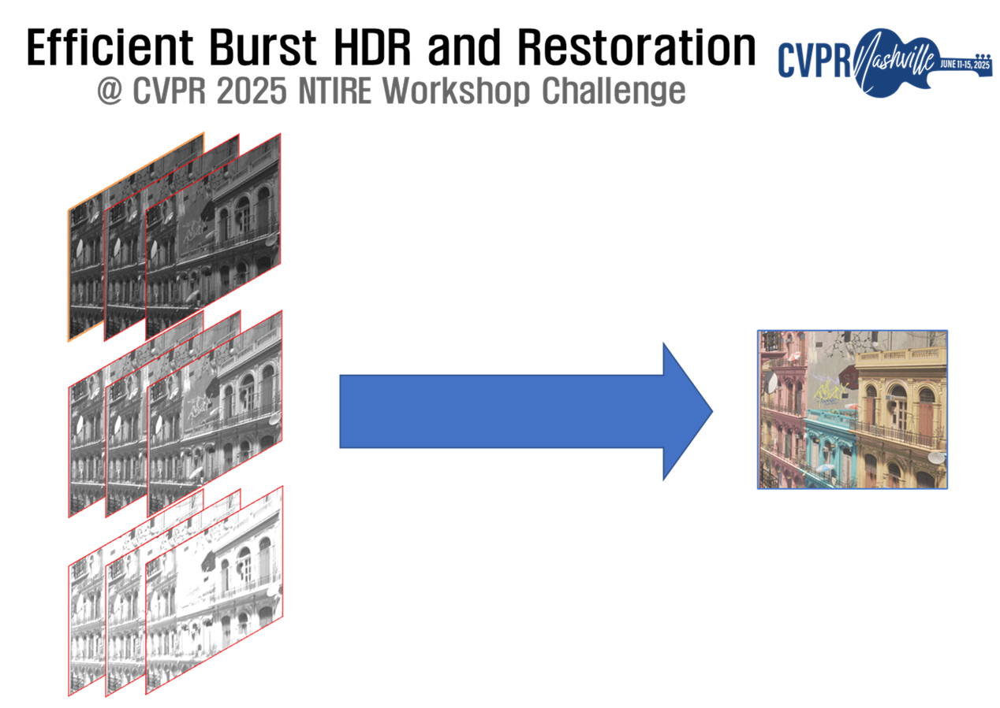
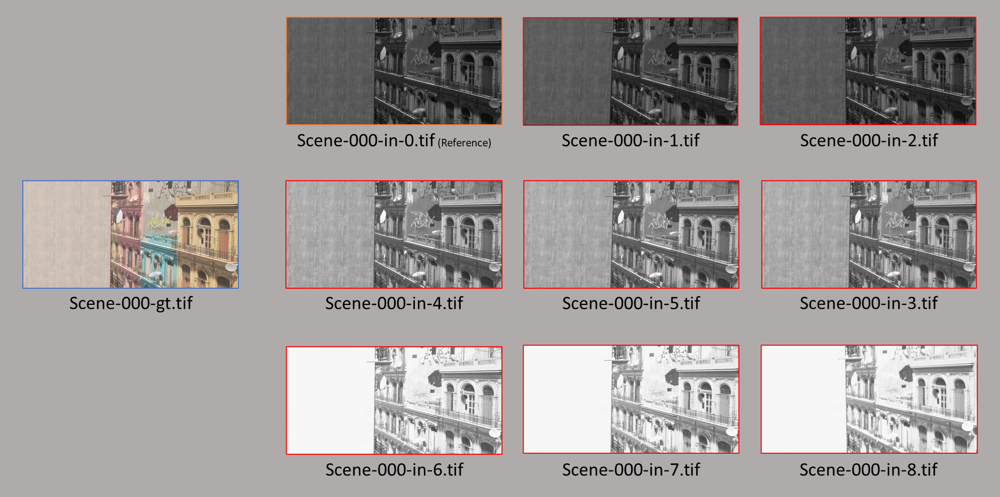

# Efficient Burst HDR and Restoration
<p align="center">
    

## Overview
This is a competition held in CVPR 2025 New Trends in Image Restoration and Enhancement (NTIRE) workshop. The goal of
this competition is to develop an efficient algorithm for burst HDR and restoration. 

More precisely, this competition involves the following tasks:
* **Multi-frame RAW image fusion** : The inputs are given as multi-frame RAW images that follow Bayer patterns (GRBG).
* **HDR image synthesis** : The given nine frames have different brightness levels. The goal is to fuse these frames into a high dynamic range (HDR) image. 
* **Restoration** : The goal is to restore GT image from degraded RAW images, such as noise, translation, motion blur, and so on.
 
Overall, it is challenging to study an efficient algorithm for both multi-frame fusion and restoration.
The ultimate goal of this work is to develop an on-device model that can be deployed on mobile devices, so there are time and memory constraints.
For more details, see https://codalab.lisn.upsaclay.fr/competitions/21316#learn_the_details-overview.


## Dataset
The training, validation, and test datasets are constructed using the same method. 
Training and validation datasets can be downloaded via an external link in the competition homepage. 
Test dataset will be provided later. All images have the same size, 768(H) x 1536(W). 

The specific configuration of datasets is as follows: 
* **Training** : Consists of 300 scenes, where each scene contains 9 RAW input frames and one GT RGB image. 
* **Validation** : Consists of 20 scenes, and GT images are hidden from participants, but PSNR and SSIM results are evaluated and will be announced on the leaderboard. 
* **Test** : Consists of 20 scenes, and both GT images and evaluation results are hidden from participants during the competition. The final ranking will be based only on the
  PSNR results of the test set.

The downloaded training dataset contains 200 scenes, where each scene consists of nine input RAW frames ("Scene-xxx-in-0.tif" through "Scene-xxx-in-8.tif") and one ground
truth image ("Scene-xxx-gt.tif"). All training files (including GT images) are recommended to be stored in one folder, in the same level as the starting kit.
For example, the structure of the directory should look like this: 
```
# directory hierarchy
{root}/{dataset}/{trn}/{Scene-xxx-in-0.tif}
{root}/{dataset}/{trn}/{Scene-xxx-gt.tif}
{root}/{starting kit}/{README.md}
```

The provided nine input frames have three brightness levels (low, middle, and high), which induces three different level of noises. 
They further have the following characteristics: (We use the naming "Scene-xxx-in-0.tif" for convenience.)
1. **Scene-xxx-in-0.tif** : This is the *reference frame*, aligned with GT image. Other all frames may not be aligned with the GT image. 
This frame  is taken by a short exposure time, thus it has a high level noise.  
2. **Scene-xxx-in-1.tif** and **Scene-xxx-in-2.tif** : These two frames have the same exposure time with the reference frame.
3. **Scene-xxx-in-3.tif** to **Scene-xxx-in-5.tif** : These three frames have the middle exposure time, thus brighter than the reference frame, which means the level of noise is slightly decreased. 
4. **Scene-xxx-in-6.tif** to **Scene-xxx-in-8.tif** : These three frames are made through high exposure time which have the lowest noise level.

<p align="center">

(Although the image appears saturated for visualization purposes, the actual data values are not clipped and maintain accurate values.)

Therefore, the key point of this competition is struggling *"how to effectively utilize the information of input frames while
considering the characteristics of each frame."* 

## Baseline model
The baseline model is given by a very simple concatenated U-net. 
The shape of input of the network follows `(batch x 9 x 768 x 1536)`, and the output shape follows `(batch x 
3 x 768 x 1536)`.
The basic loss implemented in this starting kit is MSE loss. The trained model is provided in `checkpoint_dir` folder. 
Its performance is as follows:
> **\# of model parameters** : 7.701(M)  
**Total FLOPs of the model** : 0.666(T)   
**PSNR** : 31.0134dB  
**SSIM** : 0.9581   

## Requirements
> python==3.8.10      
> numpy==1.21.1    
> opencv-python==4.7.0      
> cuda==11.7    
torch==1.13.1    
torchvision==0.14.1   


## Submissions - Validation Phase
During the validation and test phases, the input images are opened to participants. Then, participants can submit their output images on the server. 
For validation dataset, the submission system will evaluate the performance of the submitted images and provide the average PSNR, SSIM scores.
Submission for each participant (team) is limited up to 30 times per day. 

## Submissions - Test Phase
From 14th March, the test phase begins and the test input images are opened to participants. In the same way as validation phase, 
participants can submit their output images on the server. Submission during the test phase is limited up to 3 times.


### How to test your model ? (and how to measure the model's number of parameters and FLOPs)
1. Register your team in the [Google Spreadsheet](https://docs.google.com/spreadsheets/d/11U3h07nikI69hwjAORpajRZEMAw7sfWMjveoLgcinc0/edit?usp=sharing) and get your team ID.
2. git clone https://github.com/Eve-ctr/RawFusion.git
3. Download the test images from the [Google Driver](https://github.com/Eve-ctr/RawFusion/tree/main) to the folder `./testset`
4. Put the code of your model in `./models/Model_[Your_Team_ID]_[Your_Model_Name].py` 
   * Please add only one file in the folder `./models`. Please do not add other submodules.
   * Please zero pad `[Your_Team_ID]` into two digits: e.g. 00, 01, 02
5. Put the pretrained model in `./model_zoo/[Your_Team_ID]_[Your_Model_Name].[pth or pt]`
   * Please zero pad `[Your_Team_ID]` into two digits: e.g. 00, 01, 02
   * Modify My model in test demo.py to import your model in `./test_demo.py` as follows:
    ```python
    """import your models here!"""
    from models.Model_00_unet import UNet as My_model
    ```
6. `python test_demo.py` to generate result images and measure the number of parameters and FLOPs of your model.
   > **WARNING**  
   > To ensure a fair comparison between participants, please do not modify other codes as much as possible.  
   > Only allow minimal modifications to make your model code work.
7. After confirming that your model is working properly, please send us the command to download your code, e.g.,  
   * `git clone [Your repository link].`  
   * Organizers will check the model parameters and FLOPs limits and verify that the submitted images are indeed reproducible.
 
## Other competition rules
All training datasets and their images must not be shared with others or used for other purposes.
Regarding training processes and techniques, anything is possible as long as it does not violate 
the time and memory constraints we set in this challenge 
(e.g. using other public data for pre-training, importing pre-trained networks, using generative models, etc.).
In addition, it is not necessary to use all the input frames - to save memory and FLOPs, only a few frames may be selected and utilized. 

## Contacts
For any questions regarding this competition, please ask through forum of our competition site or contact to the organizers via email. 


